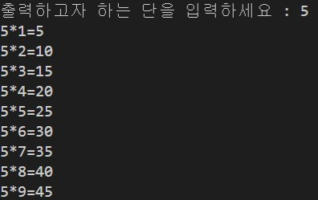
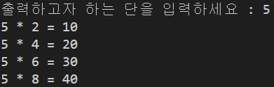
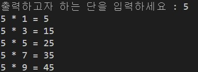
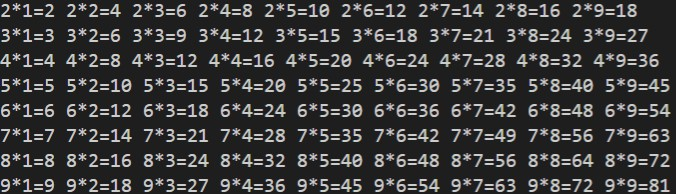
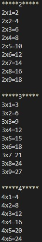

<header id="header">
		<h1><b>GuGuDan - 구구단</b></h1>
	</header>

<nav id="nav">
		<ol>
		    <li><a href="#">&nbsp;GuguScanner - 입력받은 구구단을 출력</a></li>
		    <li><a href="#">&nbsp;GuguEvenN - 입력받은 구구단을 짝수항만 출력</a></li>
            <li><a href="#">&nbsp;GuguOddN - 입력받은 구구단을 홀수항만 출력</a></li>
		    <li><a href="#">&nbsp;GuguHorizon - 2단 ~ 9단 가로 출력</a></li>
            <li><a href="#">&nbsp;GuguVerical - 2단 ~ 9단 세로 출력</a></li>
		</ol>
    </nav>
    

 
    

<h2><b>실행결과</b><h2>
    

    
GuguScanner - 입력받은 구구단을 출력

    </
    

    
GuguEvenN - 입력받은 구구단을 짝수항만 출력

    </
    

    
GuguOddN - 입력받은 구구단을 홀수항만 출력

    </
    

        
GuguHorizon - 2단 ~ 9단 가로 출력

    </
    

            
GuguVerical - 2단 ~ 9단 세로 출력

    </